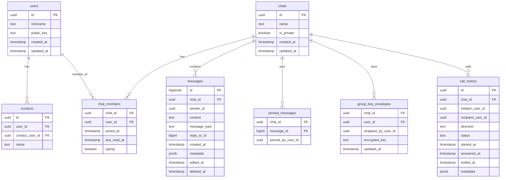

# Архитектура Stealth Messenger

## Обзор

Stealth Messenger — кроссплатформенный безопасный мессенджер (Android, Web) на Flutter с бэкендом Supabase. Ключевые принципы: **минимум данных на сервере**, **E2E-шифрование**, **P2P-звонки через WebRTC**.

## Архитектурные слои

```
┌──────────────────────────────────────────────────┐
│  UI Layer (Flutter)                              │
│  ├── Screens (chats, contacts, profile, settings)│
│  ├── Widgets (chat_bubble, message_input, ...)   │
│  └── Theme (Apple Liquid — glassmorphism)         │
├──────────────────────────────────────────────────┤
│  Service Layer                                   │
│  ├── SupabaseService (чаты, контакты, сообщения) │
│  ├── StorageService (платформенное хранилище)     │
│  └── WebRTC Support (звонки, диагностика)        │
├──────────────────────────────────────────────────┤
│  Crypto Layer                                    │
│  ├── X25519 (обмен ключами Diffie-Hellman)       │
│  ├── AES-256-GCM (шифрование сообщений)          │
│  └── Group Key Envelopes (групповые ключи)       │
├──────────────────────────────────────────────────┤
│  Backend (Supabase)                              │
│  ├── PostgreSQL (users, chats, messages, ...)    │
│  ├── Realtime (подписки на сообщения, typing)    │
│  ├── Storage (chat-media — зашифрованные файлы)  │
│  └── Broadcast (сигнализация WebRTC-звонков)     │
└──────────────────────────────────────────────────┘
```

## Структура проекта

```
client/
├── lib/
│   ├── main.dart                  # Точка входа, инициализация Supabase
│   ├── main_tabs.dart             # Навигация (4 таба)
│   ├── registration_screen.dart   # Генерация ключей, регистрация
│   ├── supabase_service.dart      # Основной сервис (чаты, крипто, звонки)
│   ├── storage_service*.dart      # Платформенное хранилище ключей
│   ├── webrtc_support*.dart       # WebRTC-абстракция
│   ├── helpers/                   # Платформенные хелперы
│   ├── themes/apple_liquid/       # Дизайн-система (glassmorphism)
│   └── ui/
│       ├── screens/               # Экраны (17 файлов)
│       └── widgets/               # Виджеты (7 файлов)
├── test/
│   └── crypto_test.dart           # Тесты E2E-шифрования
└── supabase_migrations/           # SQL-миграции (8 файлов)
```

## Схема базы данных



## Потоки данных

### Регистрация
1. Генерация UUID v4 (user_id) локально
2. Генерация пары ключей X25519 (публичный/приватный)
3. Приватный ключ → `StorageService` (secure storage)  
4. Публичный ключ → `users.public_key` в Supabase

### Отправка сообщения (приватный чат)
1. Вычисление shared secret: `X25519(myPrivateKey, theirPublicKey)`
2. Шифрование: `AES-256-GCM(message, sharedSecret)` → `nonce + ciphertext + mac`
3. Base64-кодирование → `messages.content`
4. Метаданные: `{encryption: "e2e"}`

### Отправка сообщения (групповой чат)
1. Загрузка/создание группового ключа из `group_key_envelopes`
2. Шифрование: `AES-256-GCM(message, groupKey)`
3. Метаданные: `{encryption: "group_e2e"}`

### WebRTC-звонок
1. Инициатор → Supabase Broadcast → получатель (`call_initiation`)
2. Получатель отвечает → Broadcast → `call_accept`
3. SDP offer/answer через Broadcast-канал `chat_calls:{chatId}`
4. ICE-кандидаты через тот же канал
5. Прямое P2P-соединение через STUN/TURN

## Платформенная адаптация

| Компонент | Android (IO) | Web |
|-----------|-------------|-----|
| Хранилище ключей | `flutter_secure_storage_x` (Keystore) | `SharedPreferences` (localStorage) ⚠️ |
| WebRTC | `flutter_webrtc` (native) | `flutter_webrtc` (браузерный API) |
| Файлы | `dart:io` File | File API через `file_picker` |
| Навигация | Material с нативными жестами | Адаптивный layout (960+ → desktop) |
