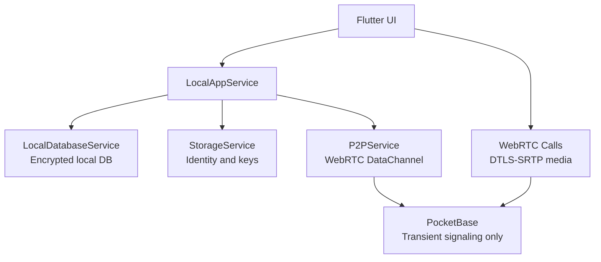

[← Начало работы](getting-started.md) · [Back to README](../README.md) · [Безопасность →](security.md)

# Архитектура Stealth Messenger

## Принципы

Stealth Messenger — local-first Flutter-мессенджер. Контакты, история сообщений, вложения и история звонков хранятся на устройстве. Сеть используется для P2P/WebRTC и временного signaling через PocketBase.

## Runtime Model



## Слои

| Сервис | Ответственность |
|--------|----------------|
| `LocalAppService` | Основной facade для UI: регистрация, контакты, чаты, сообщения, вложения, история звонков |
| `LocalDatabaseService` | Локальное зашифрованное хранилище |
| `StorageService` | Ключи и локальная идентичность |
| `P2PService` | WebRTC DataChannel для прямой доставки сообщений |
| `WebRtcSignalingService` | PocketBase SSE transport для offer/answer/candidate/hangup |
| `IncomingCallSignalingService` | Глобальная подписка на входящие звонки |

## Контакты

Контакт создаётся из contact bundle:

```text
stealth:<base64url({"v":1,"user_id":"...","name":"...","public_key":"..."})>
```

Raw user id недостаточен для E2E-чата — без `public_key` невозможно получить shared secret. UI предлагает копировать bundle из Profile.

## Сообщения

1. Клиент получает peer public key из локального контакта
2. Создаёт shared secret через X25519
3. Шифрует content через AES-GCM и ratchet helpers
4. Сохраняет ciphertext в локальную БД
5. Если DataChannel открыт — отправляет encrypted message peer-у

Вложения кодируются как local encrypted descriptor (`local-attachment:<base64url(json)>`) и расшифровываются только локально.

## Звонки

1. Caller открывает `WebRTCCallScreen`
2. Экран отправляет `offer` через PocketBase
3. Peer получает event через SSE, принимает звонок и отправляет `answer`
4. ICE candidates идут через ту же transient collection
5. Аудио/видео идут P2P через WebRTC — PocketBase не переносит media

## Структура проекта

```
client/
├── lib/
│   ├── main.dart                     # Bootstrap, .env.defaults + dart-define
│   ├── local_app_service.dart        # Local-first application facade
│   ├── local_database_service.dart   # Зашифрованное локальное хранилище
│   ├── p2p_service.dart              # WebRTC DataChannel messaging
│   ├── crypto/
│   │   └── ratchet_service.dart      # Symmetric KDF chain
│   ├── logging/
│   │   └── logger.dart               # Структурированный логгер + redaction
│   ├── services/signaling/
│   │   ├── webrtc_signaling_service.dart
│   │   ├── incoming_call_service.dart
│   │   ├── pocketbase_auth_service.dart
│   │   └── pb_user_id.dart           # UUID ↔ PB record id
│   └── ui/screens/                   # Экраны приложения
├── test/                             # Unit и widget тесты
└── pubspec.yaml
```

## Важное ограничение

PocketBase не является адресной книгой. Discovery контактов вне обмена bundle — отдельная будущая задача.

## See Also

- [Безопасность](security.md) — модель угроз и криптография
- [Конфигурация](configuration.md) — переменные окружения
- [PocketBase Setup](pocketbase-setup.md) — развёртывание signaling-сервера
