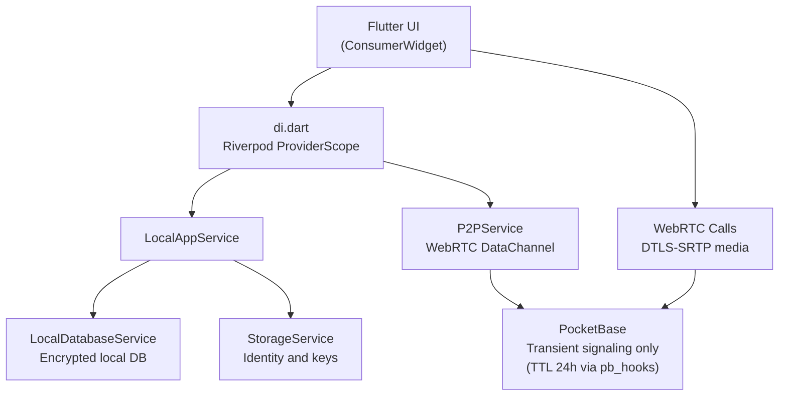

# Архитектура Stealth Messenger

## Принципы

Stealth Messenger - local-first Flutter-мессенджер. Контакты, история сообщений, вложения и история звонков хранятся на устройстве. Сеть используется для P2P/WebRTC и временного signaling через PocketBase.

## Runtime Model



## Слои

- `client/lib/di.dart` — единая точка регистрации сервисов через Riverpod. `runApp` обёрнут в `ProviderScope`; экраны читают зависимости через `ref.watch` / `ref.read`. Тестам доступно `ProviderScope.overrides[...]` для подмены сервисов без рефлексии.
- `LocalAppService` — основной facade для экранов: регистрация, контакты, чаты, сообщения, вложения, история звонков, **safety-number verification** (`verifyContact` / `detectSafetyMismatch`), **identity key rotation** (`rotateIdentityKeypair` с 24-часовым grace окном).
- `LocalDatabaseService` — локальное зашифрованное хранилище. `markContactVerified` / `clearAllContactsVerifiedAt` для safety-number snapshot'ов. `LocalDatabaseService.testOverrides` (`@visibleForTesting`) — seam для unit-тестов: IDB factory / dbPath / dbKey.
- `StorageService` — все ключи и токены (X25519 keypair, PB credentials, group keys). Политика sensitive-ключей и backend matrix задокументированы в doc-комментарии файла; regression guard — `client/test/security/secure_storage_policy_test.dart`.
- `P2PService` — WebRTC DataChannel для прямой доставки сообщений.
- `WebRtcSignalingService` — PocketBase SSE transport для offer/answer/candidate/hangup.
- `IncomingCallSignalingService` — глобальная подписка на входящие звонки.

## Безопасность UX (cross-cutting)

- **Safety number:** `LocalAppService.getSafetyNumber` строит SHA-256 fingerprint `(ownPublicKey, otherPublicKey)`; UI-диалог `client/lib/ui/screens/chats/safety_number_dialog.dart` показывает его пользователю и при подтверждении пишет `verified_at` + `verified_safety_number` в запись контакта. В списке контактов рядом с именем — ✓ (verified) или ⚠ (mismatch). Подробности — [`docs/SECURITY.md`](SECURITY.md#safety-number-verification).
- **Identity key rotation:** кнопка "Rotate identity key" в Profile вызывает `rotateIdentityKeypair`. Предыдущая keypair хранится 24 ч в `privateKey_prev`/`publicKey_prev` для дешифровки in-flight сообщений; по истечении grace-периода prev-материал стирается автоматически.
- **Web CSP:** `client/web/index.html` несёт `Content-Security-Policy` meta. Walk-through директив, smoke-чек и maintenance в [`docs/web-csp.md`](web-csp.md).
- **PocketBase TTL:** server-side cron-хук [`pb_hooks/rtc_cleanup.pb.js`](../pb_hooks/rtc_cleanup.pb.js) каждый час удаляет `rtc_signaling` записи старше 24 ч.

## Контакты

Контакт создается из contact bundle:

```text
stealth:<base64url({"v":1,"user_id":"...","name":"...","public_key":"..."})>
```

Raw user id недостаточен для E2E-чата, потому что без `public_key` невозможно получить shared secret. UI предлагает копировать bundle из Profile.

## Сообщения

1. Клиент получает peer public key из локального контакта.
2. Создает shared secret через X25519.
3. Шифрует content через AES-GCM и ratchet helpers.
4. Сохраняет ciphertext в локальную БД.
5. Если DataChannel открыт, отправляет encrypted message peer-у.

Вложения кодируются как local encrypted descriptor (`local-attachment:<base64url(json)>`) и расшифровываются только локально.

## Звонки

1. Caller открывает `WebRTCCallScreen`.
2. Экран отправляет `offer` через PocketBase.
3. Peer получает event через SSE, принимает звонок и отправляет `answer`.
4. ICE candidates идут через ту же transient collection.
5. Аудио/видео идут P2P через WebRTC, PocketBase не переносит media.

## Конфигурация

`client/.env`:

```env
POCKETBASE_URL=https://signal.example.com
TURN_URL=turn:example.com:3478
TURN_USERNAME=
TURN_PASSWORD=
TURNS_URL=turns:example.com:443?transport=tcp
TURNS_USERNAME=
TURNS_PASSWORD=
```

## Важное ограничение

PocketBase сейчас не является адресной книгой. Discovery контактов вне обмена bundle - отдельная будущая задача.
