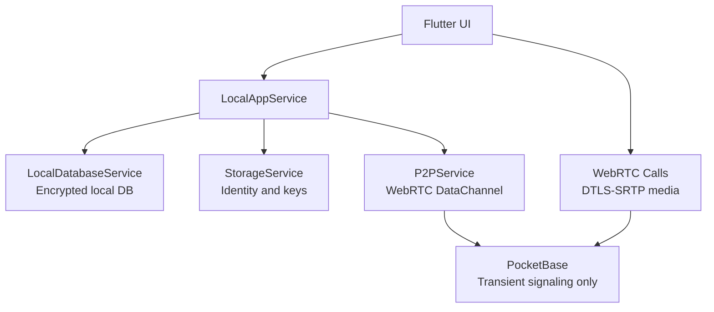

# Архитектура Stealth Messenger

## Принципы

Stealth Messenger - local-first Flutter-мессенджер. Контакты, история сообщений, вложения и история звонков хранятся на устройстве. Сеть используется для P2P/WebRTC и временного signaling через PocketBase.

## Runtime Model



## Слои

- `LocalAppService` - основной facade для экранов: регистрация, контакты, чаты, сообщения, вложения, история звонков.
- `LocalDatabaseService` - локальное зашифрованное хранилище.
- `StorageService` - ключи и локальная идентичность.
- `P2PService` - WebRTC DataChannel для прямой доставки сообщений.
- `WebRtcSignalingService` - PocketBase SSE transport для offer/answer/candidate/hangup.
- `IncomingCallSignalingService` - глобальная подписка на входящие звонки.

## Контакты

Контакт создается из contact bundle:

```text
stealth:<base64url({"v":1,"user_id":"...","name":"...","public_key":"..."})>
```

Raw user id недостаточен для E2E-чата, потому что без `public_key` невозможно получить shared secret. UI предлагает копировать bundle из Profile.

## Сообщения

1. Клиент получает peer public key из локального контакта.
2. Создает shared secret через X25519.
3. Шифрует content через AES-GCM и ratchet helpers.
4. Сохраняет ciphertext в локальную БД.
5. Если DataChannel открыт, отправляет encrypted message peer-у.

Вложения кодируются как local encrypted descriptor (`local-attachment:<base64url(json)>`) и расшифровываются только локально.

## Звонки

1. Caller открывает `WebRTCCallScreen`.
2. Экран отправляет `offer` через PocketBase.
3. Peer получает event через SSE, принимает звонок и отправляет `answer`.
4. ICE candidates идут через ту же transient collection.
5. Аудио/видео идут P2P через WebRTC, PocketBase не переносит media.

## Конфигурация

`client/.env`:

```env
POCKETBASE_URL=https://signal.example.com
TURN_URL=turn:example.com:3478
TURN_USERNAME=
TURN_PASSWORD=
TURNS_URL=turns:example.com:443?transport=tcp
TURNS_USERNAME=
TURNS_PASSWORD=
```

## Важное ограничение

PocketBase сейчас не является адресной книгой. Discovery контактов вне обмена bundle - отдельная будущая задача.
