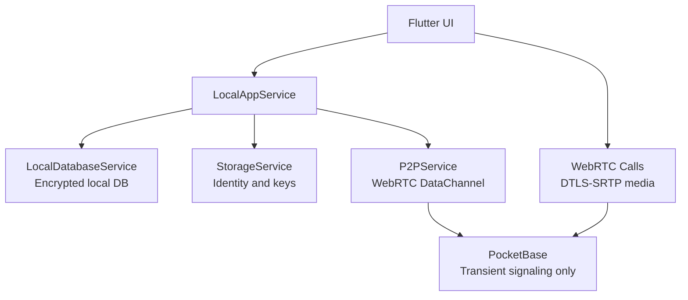

[Design System →](design-system.md)

# Архитектура Stealth Messenger

## Принципы

Stealth Messenger - local-first Flutter-мессенджер. Контакты, история сообщений, вложения и история звонков хранятся на устройстве. Сеть используется для P2P/WebRTC и временного signaling через PocketBase.

## Runtime Model



## Слои

- `LocalAppService` - основной facade для экранов: регистрация, контакты, чаты, сообщения, вложения, история звонков.
- `LocalDatabaseService` - локальное зашифрованное хранилище.
- `StorageService` - ключи и локальная идентичность.
- `P2PService` - WebRTC DataChannel для прямой доставки сообщений.
- `WebRtcSignalingService` - PocketBase SSE transport для offer/answer/candidate/hangup.
- `IncomingCallSignalingService` - глобальная подписка на входящие звонки.

## UI / Дизайн-система

Все экраны зависят от единого слоя дизайна `client/lib/themes/apple_liquid/`:

- **`constants/`** — `AppColors`, `AppSpacing`, `AppTypography` (Geist + Geist Mono), `AppMotion`, `AppElevation`, `AppEffects`, `AppHaptics`, `GlassStyles`.
- **`widgets/`** — `GlassContainer`, `GlassAppBar`, `GlassBottomNavBar`, `GlassChatBubble`, `GlassMessageInput`, `SectionHeader`, `ListDivider`, `StatusChip`. Подпапки `chats/` (`ChatTile`), `contacts/` (`ContactTile`), `profile/` (5 cards), `call/` (`CallHudOverlay`, `CallControlButtons`).
- **`feedback/`** — `showStealthSnackBar`, `showStealthDialog`, `StealthHaptics`, `StealthLoadingIndicator`, `StealthSkeletonTile`.
- **`effects/`** — `ScanlineOverlay`, `GrainOverlay` (фирменные визуальные моменты; автоотключение в светлой теме).
- **`navigation/`** — `GlassPageRoute` (пользовательский переход).
- **`motion/`** — `StaggeredListView` (оркестрированное появление элементов списка).

Токены, фирменные элементы и двойная идентичность (темная = фирменная, светлая = высокая контрастность)
задокументированы в `docs/design-system.md`. Тема управляется через
`ThemeController` (`ValueNotifier<ThemeMode>`); при слиянии с `feature/hardening-di-secure-storage`
будет заменена на Riverpod-провайдер.

## Контакты

Контакт создается из бандла (bundle) контакта:

```text
stealth:<base64url({"v":1,"user_id":"...","name":"...","public_key":"..."})>
```

Сырой `user_id` недостаточен для E2E-чата, потому что без `public_key` невозможно получить общий секрет. UI предлагает копировать bundle из Профиля.

## Сообщения

1. Клиент получает публичный ключ пира (peer public key) из локального контакта.
2. Создает общий секрет (shared secret) через X25519.
3. Шифрует контент через AES-GCM и ratchet helpers.
4. Сохраняет зашифрованный текст в локальную БД.
5. Если DataChannel открыт, отправляет зашифрованное сообщение пиру.

Вложения кодируются как локальный зашифрованный дескриптор (`local-attachment:<base64url(json)>`) и расшифровываются только локально.

## Звонки

1. Звонящий открывает `WebRTCCallScreen`.
2. Экран отправляет `offer` через PocketBase.
3. Пир получает событие через SSE, принимает звонок и отправляет `answer`.
4. Кандидаты ICE (ICE candidates) идут через ту же временную коллекцию.
5. Аудио/видео идут P2P через WebRTC, PocketBase не переносит медиаданные.

## Конфигурация

`client/.env`:

```env
POCKETBASE_URL=https://signal.example.com
TURN_URL=turn:example.com:3478
TURN_USERNAME=
TURN_PASSWORD=
TURNS_URL=turns:example.com:443?transport=tcp
TURNS_USERNAME=
TURNS_PASSWORD=
```

## Важное ограничение

PocketBase сейчас не является адресной книгой. Обнаружение контактов без обмена бандлами - отдельная будущая задача.

## See Also

- [Design System](design-system.md) — дизайн-токены и UI-компоненты
- [Security](SECURITY.md) — модель угроз и криптография
- [Deployment](deployment.md) — деплой signaling + TURN
