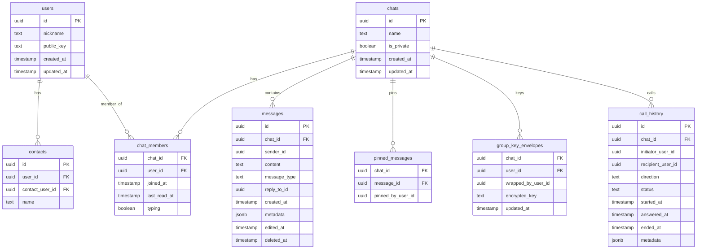

# Архитектура Stealth Messenger

## Обзор

Stealth Messenger — кроссплатформенный безопасный мессенджер (Android, Web) на Flutter. Ключевые принципы: **local-first хранение**, **E2E-шифрование**, **P2P-аудио- и видеозвонки через WebRTC**, **Supabase только как резервное/синхронизирующее хранилище**.

## Модель данных: Local-First

```
┌─────────────────────────────────────────────────────────┐
│  PRIMARY: LocalDatabaseService (idb_shim + AES-256-GCM) │
│  ├── messages  — зашифрованные сообщения на устройстве  │
│  └── chats     — кеш чатов для offline-доступа          │
├─────────────────────────────────────────────────────────┤
│  BACKUP: Supabase (PostgreSQL + Realtime + Storage)      │
│  ├── синхронизация при наличии сети                      │
│  ├── публичные ключи пользователей                       │
│  ├── сигналинг WebRTC-звонков (Broadcast)                │
│  └── зашифрованные медиафайлы (Storage)                  │
└─────────────────────────────────────────────────────────┘
```

### Режимы работы

| Режим | Описание | Управление |
|-------|----------|------------|
| **Online (по умолчанию)** | Читает из Supabase, всегда пишет локально + в Supabase | `useSupabase = true` |
| **Offline / работа без сервера** | Читает и пишет только локально | `useSupabase = false` |
| **Деградация** | При ошибке Supabase автоматический fallback на локальную БД | Прозрачно для пользователя |

`useSupabase` хранится в `SharedPreferences`. Устанавливается в `false` через кнопку **«Работать оффлайн»** на экране `StartupErrorScreen`.

## Архитектурные слои

```
┌──────────────────────────────────────────────────┐
│  UI Layer (Flutter)                              │
│  ├── Screens (chats, contacts, profile, settings)│
│  ├── Widgets (chat_bubble, message_input, ...)   │
│  └── Theme (Apple Liquid — glassmorphism)         │
├──────────────────────────────────────────────────┤
│  Service Layer                                   │
│  ├── SupabaseService (чаты, контакты, сообщения) │
│  ├── LocalDatabaseService (primary storage)      │
│  ├── P2PService (WebRTC DataChannel messaging)   │
│  ├── StorageService (платформенное хранилище)    │
│  └── WebRTC Support (звонки, диагностика)        │
├──────────────────────────────────────────────────┤
│  Crypto Layer                                    │
│  ├── X25519 (обмен ключами Diffie-Hellman)       │
│  ├── AES-256-GCM (шифрование сообщений)          │
│  ├── Double Ratchet (forward secrecy)            │
│  └── Group Key Envelopes (групповые ключи)       │
├──────────────────────────────────────────────────┤
│  Backend (Supabase) — резервное хранилище        │
│  ├── PostgreSQL (users, chats, messages, ...)    │
│  ├── Realtime (подписки на сообщения, typing)    │
│  ├── Storage (chat-media — зашифрованные файлы)  │
│  └── Broadcast (сигнализация WebRTC-звонков)     │
└──────────────────────────────────────────────────┘
```

## Структура проекта

```
client/
├── lib/
│   ├── main.dart                  # Точка входа; StartupErrorScreen с offline-mode
│   ├── main_tabs.dart             # Навигация (4 таба)
│   ├── registration_screen.dart   # Генерация ключей, регистрация
│   ├── supabase_service.dart      # Основной сервис (чаты, крипто, звонки)
│   ├── local_database_service.dart# Primary storage (idb_shim + AES-256-GCM)
│   ├── p2p_service.dart           # WebRTC DataChannel для offline-messaging
│   ├── p2p_discovery_service.dart # Обнаружение пиров
│   ├── storage_service*.dart      # Платформенное хранилище ключей
│   ├── webrtc_support*.dart       # WebRTC-абстракция
│   ├── helpers/                   # Платформенные хелперы (crypto_helper, ...)
│   ├── themes/apple_liquid/       # Дизайн-система (glassmorphism)
│   └── ui/
│       ├── screens/               # Экраны (18 файлов)
│       └── widgets/               # Виджеты (7 файлов)
├── test/
│   └── crypto_test.dart           # Тесты E2E-шифрования
└── supabase_migrations/           # SQL-миграции (8 файлов)
```

## Схема базы данных



## Потоки данных

### Регистрация
1. Генерация UUID v4 (user_id) локально
2. Генерация пары ключей X25519 (публичный/приватный)
3. Приватный ключ → `StorageService` (secure storage)  
4. Публичный ключ → `users.public_key` в Supabase

### Отправка сообщения (online)
1. Вычисление `ratchetIndex` из Supabase (точный счётчик)
2. Шифрование: `AES-256-GCM(message, sharedSecret)` → `nonce + ciphertext + mac`
3. Base64-кодирование → `messages.content`
4. **Сохранение в `LocalDatabaseService`** (всегда)
5. Отправка в `Supabase.messages` (если `useSupabase = true`)

### Отправка сообщения (offline / `useSupabase = false`)
1. Вычисление `ratchetIndex` из локальной БД
2. Шифрование идентично online-режиму
3. **Сохранение только в `LocalDatabaseService`**
4. При восстановлении сети — синхронизация не реализована (будущая задача)

### Получение сообщений
1. Если `useSupabase = true`: читаем из Supabase, кешируем каждое сообщение локально
2. Если `useSupabase = false`: читаем из `LocalDatabaseService`
3. При ошибке Supabase: автоматический fallback на `LocalDatabaseService`

### Получение чатов
- При успешном запросе к Supabase — каждый чат сохраняется в `_localDb.saveChat()`
- При ошибке — `getChats()` возвращает данные из `_localDb.getChats()`

### WebRTC-звонок (аудио или видео)
1. Старт из экрана **Контакты**; в событии `call_initiation` передаётся `call_type`: `audio` или `video`
2. SDP offer/answer и ICE-кандидаты через Supabase Broadcast-канал `chat_calls:{chatId}`
3. Прямое P2P-медиа через STUN/TURN (медиа не проходит через Supabase)
4. TURN настраивается в `client/.env`: `TURN_URL`, `TURN_USERNAME`, `TURN_PASSWORD`

### P2P DataChannel (экспериментально)
- `P2PService` устанавливает WebRTC DataChannel для прямой передачи сообщений
- При открытом канале — сообщения идут P2P + кешируются локально
- При недоступности канала — fallback на `SupabaseService.sendMessage`

## Шифрование локальной БД

`LocalDatabaseService` хранит все данные в зашифрованном виде:
- Уникальный ключ `local_db_key` (AES-256) генерируется при первом запуске
- Ключ хранится в `StorageService` (Android Keystore / Secure Storage)
- Каждая запись: `{ payload: AES-GCM(jsonEncode(message)), chatId, timestamp }`

## Платформенная адаптация

| Компонент | Android (IO) | Web |
|-----------|-------------|-----|
| Хранилище ключей | `flutter_secure_storage_x` (Keystore) | `SharedPreferences` (localStorage) ⚠️ |
| Локальная БД | `idb_shim` + `sembast_io` | `idb_shim` + IndexedDB |
| WebRTC | `flutter_webrtc` (native) | `flutter_webrtc` (браузерный API) |
| Файлы | `dart:io` File | File API через `file_picker` |
| Навигация | Material с нативными жестами | Адаптивный layout (960+ → desktop) |
