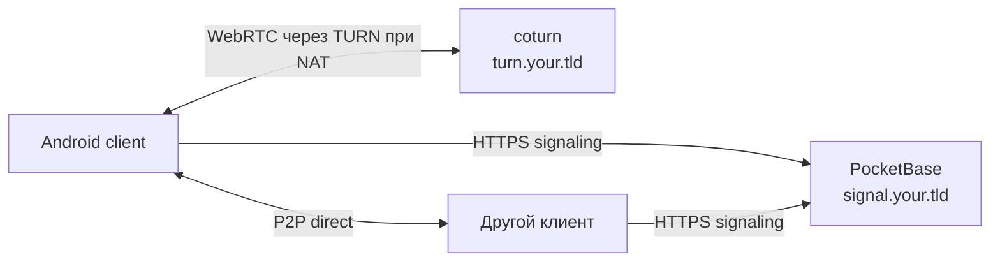

[← Security](SECURITY.md) · [Back to README](../README.md) · [PocketBase Setup →](POCKETBASE_SETUP.md)

# Деплой signaling + TURN на VPS

Stealth Messenger — **local-first** мессенджер. На сервере **не** крутится само приложение: только инфраструктура для P2P-звонков и сообщений через WebRTC.

История чатов, контакты и вложения остаются на устройстве. Сервер нужен для временного signaling и, при необходимости, TURN relay.

## Зачем это нужно

| Компонент | Роль |
|-----------|------|
| **PocketBase** | Временный signaling: `offer` / `answer` / `candidate` / `hangup` между клиентами |
| **Caddy** | HTTPS для PocketBase (Let's Encrypt) |
| **coturn (TURN)** | Relay-трафик, когда P2P не проходит через NAT (Wi‑Fi, мобильная сеть, VPN) |

Без signaling звонки не устанавливаются. Без TURN часто не работают сообщения и медиа за NAT.



## Что добавлено в репозиторий

Готовый деплой: [`server/docker/`](../server/docker/).

| Файл / каталог | Назначение |
|----------------|------------|
| `docker-compose.yml` | PocketBase **0.22.21** + Caddy + coturn |
| `docker-compose.local.yml` | Локальный smoke-тест без домена (`:8090`) |
| `Caddyfile.template`, `coturn/turnserver.conf.template` | Шаблоны конфигов (рендерятся через `envsubst`) |
| `.env.example` | Домены, IP VPS, учётные данные TURN |
| [`server/pocketbase/rtc_signaling_import.json`](../server/pocketbase/rtc_signaling_import.json) | Схема коллекции и API rules |
| [`server/pb_hooks/`](../server/pb_hooks/) | PocketBase hooks (cleanup, push-заготовка) |

### Скрипты (`server/docker/scripts/`)

| Скрипт | Назначение |
|--------|------------|
| `install.sh` | Разворачивает стек в `~/stealth-server` (или `DEPLOY_DIR`) |
| `import-rtc-signaling.sh` | Импорт коллекции `rtc_signaling` через Admin API |
| `build-client-apk.sh` | Release APK с `--dart-define` для PocketBase и TURN |
| `verify-signaling.sh` | Smoke-тест signaling (`pocketbase_signaling_smoke_test.dart`) |

Подробная схема PocketBase и rules — в [POCKETBASE_SETUP.md](POCKETBASE_SETUP.md). Сборка и установка APK — в [INSTALL_ANDROID.md](../INSTALL_ANDROID.md) и [ANDROID_RELEASE.md](ANDROID_RELEASE.md).

## Предварительные требования

- VPS с Docker и Docker Compose
- Два DNS A-записи на IP сервера: `signal.your.tld`, `turn.your.tld`
- Открытые порты: `22`, `80`, `443`, `3478` (tcp+udp), `5349` (tcp), `49152–65535/udp`
- На машине разработки: Flutter SDK (для сборки APK и smoke-теста)

> **Версия PocketBase:** образ зафиксирован на `0.22.21` — проверенная совместимость с Dart SDK `pocketbase ^0.18` и realtime SSE.

## Деплой на VPS (SSH)

```bash
cd server/docker
cp .env.example .env
nano .env   # SIGNAL_DOMAIN, TURN_DOMAIN, VPS_PUBLIC_IP, TURN_PASSWORD
chmod +x scripts/*.sh
./scripts/install.sh
```

После старта:

1. Откройте `https://signal.your.tld/_/` и создайте admin.
2. Импортируйте коллекцию:

   ```bash
   POCKETBASE_ADMIN_PASSWORD='...' ./scripts/import-rtc-signaling.sh
   docker compose -f ~/stealth-server/docker-compose.yml restart pocketbase
   ```

3. Выпустите TLS-сертификат для TURN (coturn на порту `5349`). Можно через certbot или отдельный скрипт — см. [POCKETBASE_SETUP.md](POCKETBASE_SETUP.md) (раздел про TLS/TURNS).

Hooks из `server/pb_hooks/`:

- `rtc_cleanup.pb.js` — удаляет signaling-записи старше ~1 часа
- `push_dispatcher.pb.js` — опциональный UnifiedPush (без `pushSubscription` не мешает работе)

## Сборка клиента

На машине с Flutter:

```bash
cd server/docker
# .env должен содержать ваши реальные домены, не example.com
./scripts/build-client-apk.sh
```

APK: `client/build/app/outputs/flutter-apk/app-release.apk`

Клиент получает URL через `--dart-define`:

- `POCKETBASE_URL=https://signal.your.tld`
- `TURN_URL`, `TURNS_URL`, `TURN_USERNAME`, `TURN_PASSWORD`

## Проверка

**Signaling (с машины разработки):**

```bash
cd server/docker
POCKETBASE_URL=https://signal.your.tld \
POCKETBASE_ADMIN_PASSWORD='...' \
./scripts/verify-signaling.sh
```

**Локально без домена:**

```bash
cd server/docker
docker compose -f docker-compose.local.yml up -d
# Admin: http://127.0.0.1:8090/_/
POCKETBASE_ADMIN_PASSWORD='...' POCKETBASE_URL=http://127.0.0.1:8090 \
  ./scripts/import-rtc-signaling.sh
export POCKETBASE_TEST_URL=http://127.0.0.1:8090
cd ../../client && flutter test test/services/signaling/pocketbase_signaling_smoke_test.dart
```

**На двух телефонах:** оба APK с одним `POCKETBASE_URL`, обмен contact bundle, тест звонка.

## Что проверено локально

- PocketBase 0.22 в Docker на `:8090`
- Импорт `rtc_signaling`
- Smoke-тест: offer → answer → hangup между двумя клиентами
- Release APK (~89 MB) собирается через `build-client-apk.sh`

## Вне scope этого деплоя

- CI/CD автодеплой на VPS
- Хостинг APK и автообновления (`APP_UPDATE_MANIFEST_URL`)
- Flutter web на nginx
- Полный bootstrap VPS (`ufw`, `certbot`) — выполняется вручную или доп. скриптами

## Эксплуатация

- **Бэкап:** `~/stealth-server/pb_data/` или PocketBase Admin → Backup
- **Обновление образов:** `cd ~/stealth-server && docker compose pull && docker compose up -d`
- **Логи:** `docker compose logs -f pocketbase`

## See Also

- [POCKETBASE_SETUP.md](POCKETBASE_SETUP.md) — схема `rtc_signaling`, API rules, cleanup hook
- [ARCHITECTURE.md](ARCHITECTURE.md) — роль PocketBase и TURN в runtime-модели
- [INSTALL_ANDROID.md](../INSTALL_ANDROID.md) — установка APK на телефон
